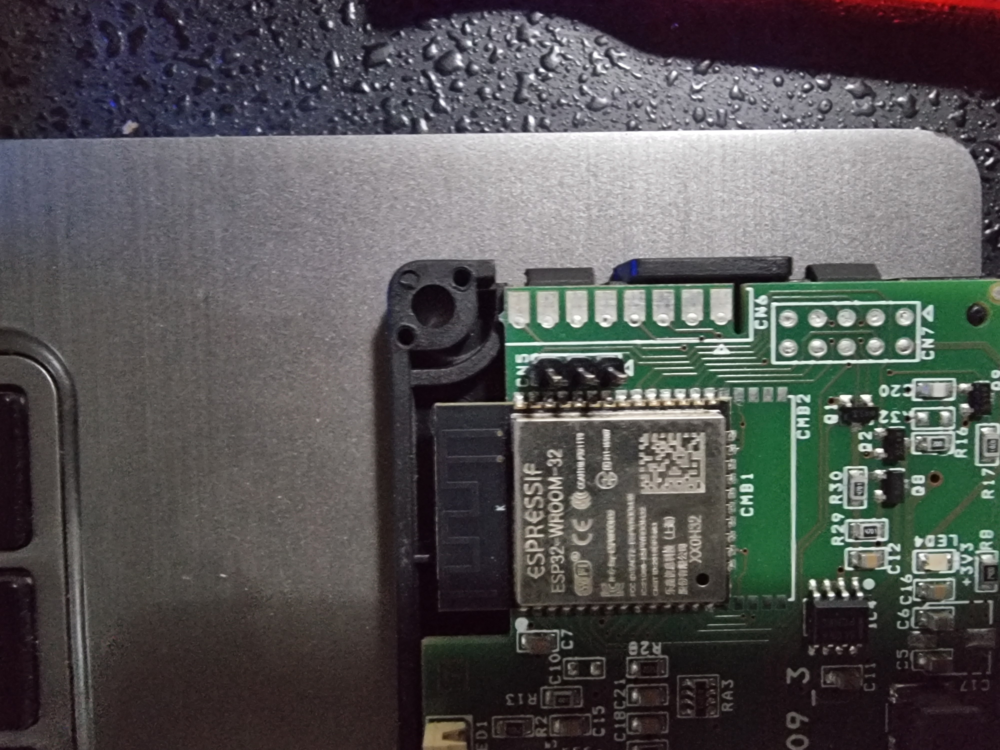

Diadema IDRO / Total Control app / uncloud to Home Assistant

"uncloud" La Nordica Extraflame Diadema IDRO / NAVEL 2.0 Wifi Modul to Home Assistant.

What has happened so far.

I can still record when something is sent to the stove.
It's just that my programming knowledge is outdated (rusty).
Well, here's what I've found out so far.

Total Control
https://totalcontrol.extraflame.it
or the new one i found in this log,
http://wifi.extraflame.it

I opened the wifi adapter (white label).
And found 3 pins on the ESP32.

GND is drawn, just need to find rx and tx.
So in my case now (Blue = GND, Orange = RX, Yellow = TX)
You need a 3.3v usb2uart.
Note (green is not connected)

Then connect with putty, serial port of usb2uart, baud rate 115200.

I was very surprised that it is an esp32 wroom and there is a partition with spiffs.

[extraflame.txt](https://github.com/jeng37/Total-Control-app-to-HA/blob/main/extraflame.txt)

Unfortunately I can't make a backup of the esp. I always get the error message
A fatal error occurred: Failed to connect to ESP32: No serial data received.

esptool -p COM7 -b 115200 read_flash 0 0x400000 flash.bin

Instructions [here](https://jmswrnr.com/blog/hacking-a-smart-home-device#dumping-flash)

 
Then based on[
philibertc
Philibert Cheminot ](https://github.com/philibertc/micronova_controller)
i created the controller.
https://github.com/philibertc/micronova_controller/wiki/How-to-build-it

after that,
i got the software from [
Jorre05
Joris S ](https://github.com/Jorre05/micronova)
and installed it on a Wemos d1 mini.
changed some variables and it´s running.

[Diadema_IDRO](https://github.com/jeng37/Total-Control-app-to-HA/blob/main/Diadema_IDRO.txt) read write locations.
   
   
My Stove model is "Extraflame Diadema IDRO"

 News:
 Added a pellet level sensor. 

 Hardware components:
 Wemos D1 Mini and HC-SR04 ultrasonic sensor.
 HC-SR04: 
          Vcc to wemos 5v
          Trig to wemos pin D4
          Echo to wemos pin D3
          Gnd to wemos Gnd

 Reed sensor: A magnetic switch that closes when a magnet approaches and opens when it moves away.
LED: A simple LED controlled via a GPIO pin of the ESP8266/ESP32.
Resistor: A 220-330 ohm resistor in series with the LED to limit the current.
ESP8266/ESP32: A microcontroller powered by ESPHome.
Wiring:
Reed sensor:

A reed sensor pin to GND.
The other pin to a digital GPIO pin of the ESP (e.g. GPIO14) and at the same time to 3.3V via a pull-up resistor (approx. 10k Ohm).
LED:

Anode (longer pin) of the LED to a GPIO pin of the ESP (e.g. GPIO5) via a 220-330 ohm resistor.
Cathode (shorter pin) of the LED to GND.

Code:
<pre><code>
esphome:
  name: pelletlevel
  friendly_name: PelletLevel

esp8266:
  board: d1_mini

# Enable logging
logger:

# Enable Home Assistant API
api:
  encryption:
    key: "xxxxxxxxxxxxxxxxxxxxxxxxxxxxxxxxxxxxxx"

ota:
  - platform: esphome
    password: "xxxxxxxxxxxxxxxxxxxxxxxxxxxxxxxx"

wifi:
  ssid: !secret wifi_ssid
  password: !secret wifi_password
  manual_ip:
    static_ip: 192.x.x.x
    gateway: 192.x.x.x
    subnet: 255.x.x.x
    dns1: 192.x.x.x  

  # Enable fallback hotspot (captive portal) in case wifi connection fails
  ap:
    ssid: "Pelletslevel Fallback Hotspot"
    password: "xxxxxxxxxxxxx"

captive_portal:

sensor:
  - platform: ultrasonic
    trigger_pin: D4
    echo_pin: D3
  
    name: "pellet level in percent"
    update_interval: 30s
# Optional variables:
   
    icon: "mdi:sack-percent"
    accuracy_decimals: 0      
    filters:
    # Calculates in %
    # Replace 0.46 by the height of hopper. From the sensor to the bottom.
    # I used this website to know how I should multiply my values :https://www.skillsyouneed.com/num/percent-change.html 
    - lambda: return (0.67-x)*(100/0.67);
    unit_of_measurement: "%"
         
# Reed switch configuration
binary_sensor:
  - platform: gpio
    pin: GPIO14
    name: "Reed Sensor"
    device_class: door
    on_press:
      then:
        - switch.turn_on: led_switch
        - lambda: |-
            if (id(led_switch).state) {
              ESP_LOGD("Reed Sensor", "LED is ON");
            } else {
              ESP_LOGD("Reed Sensor", "LED is OFF");
            }
    on_release:
      then:
        - switch.turn_off: led_switch
        - lambda: |-
            if (id(led_switch).state) {
              ESP_LOGD("Reed Sensor", "LED is ON");
            } else {
              ESP_LOGD("Reed Sensor", "LED is OFF");
            }
# LED configuration
switch:
  - platform: gpio
    pin: GPIO5
    id: led_switch
    name: "LED"

</code></pre>

